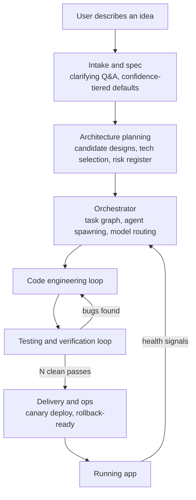
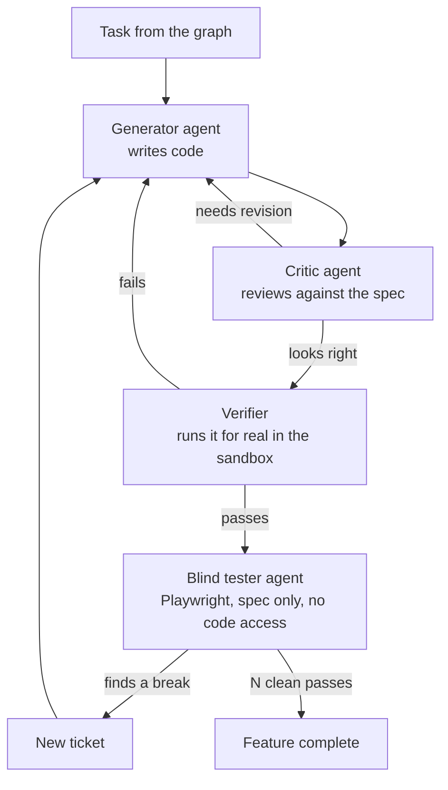

# Architecture reference

Companion to `MASTER_PROMPT.md`. This is the full detail behind the six build phases: how the ~90 in-scope capabilities group into subsystems, how data actually flows through the system, what to build each piece with, and how model routing works. Keep this updated as the design changes — it's the source of truth, not the master prompt.

## System overview

Walkthrough: a raw idea becomes a structured spec (with the human answering only the questions that actually matter), the spec becomes a validated architecture and tech choice, the orchestrator turns that into a task graph and works it, every completed task goes through a real testing loop before anything ships, and the running app's own health feeds back into the orchestrator so problems in production can spawn new tasks automatically.

## Core build loop, in detail

This is what happens inside the "code engineering loop → testing loop" pair above, for every single task.

The three roles (generator, critic, verifier) run on separate prompts, and ideally separate models — the point is that the same agent never both writes code and declares it correct. The blind tester is a fourth, later checkpoint: it only ever sees the spec and the running app, never the source, so it can't rationalize away a bug the way an agent that wrote the code might.

## Subsystems

Every item below is drawn from the buildable core only (~components 1-90 / layers 1-4 of the earlier draft). Nothing from the organizational-learning, product-council, AI-operating-system, research-lab, or federation layers is included anywhere in this document — see `MASTER_PROMPT.md`'s "Out of scope" section for that boundary.

### A. Intake and specification
Turns a free-text idea into something buildable.
- Intent understanding and canonicalization — normalize whatever form the idea arrives in into a structured representation
- Contradiction and assumption detection — catch conflicting requirements before they become conflicting code
- Question optimization — generate clarifying questions tiered by reversibility × blast radius × confidence: auto-fill silently when cheap to change later, ask a blocking question when foundational and ambiguous, auto-fill with a flagged default in between
- Specification compiler — produces the canonical build target from the answered questions
- Feasibility and complexity analysis — flags before building starts if something is genuinely infeasible with the available tools/budget
- Architecture search and validation — generates candidate architectures, checks them against constraints, picks and justifies one
- Technology selection — chooses the stack, filtered by the license and tooling rules in this document
- Execution blueprint and risk register — the ordered plan and its known risk points, both handed to the orchestrator

### B. Orchestration and execution runtime
The engine room. Everything else is a tool this layer calls.
- Master orchestrator — owns the task graph and the overall run state
- Task decomposition and dependency graph — breaks the blueprint into ordered, parallelizable tasks
- Agent spawning — creates a scoped sub-agent per task with only the context and tools that task needs
- Skill retrieval — a library of modular, retrievable playbooks (frontend patterns, backend patterns, security checklists, and so on), pulled in per task rather than stuffed into one giant prompt, and refined over time from what actually worked
- Context distribution and compression — gives each agent enough context to do its task without re-sending the whole project every time
- Repository intelligence — represents the codebase as a queryable graph instead of re-reading full files, which is what keeps this viable on large repos
- Execution sandbox and workspace manager — isolated, containerized execution per task
- Tool orchestration and reliability — wraps external tools (linters, test runners, scanners) with retry and failure handling so a flaky tool doesn't look like a flaky build
- External connectors — GitHub (and anything added after it) go through MCP as the general connector mechanism rather than a bespoke integration per service. This is where the rest of the industry converged on this problem (Claude Code and GitHub Copilot both use it); the practical benefit is that the next integration is a new MCP server pointed at by config, not new code inside the orchestrator
- Lifecycle hooks — explicit, deterministic checks fired at defined points (after any dependency change, before any outbound log line, before any commit), not enforcement buried inside a large function where it's easy to silently skip. If it's a rule, it's a hook, not a comment saying to remember something
- Secrets manager — nothing hardcoded, nothing logged in plaintext
- Model router and consensus — see "Model routing strategy" below
- Inter-agent communication — agents exchange structured task/result messages through the orchestrator (a task descriptor in, a diff-plus-status out), never raw chained text directly between agents; this is what keeps the whole thing debuggable
- Decision tracking and engineering-economics tracking — logs what was decided and what it cost, continuously, not as an afterthought
- Parallel execution controller — runs independent tasks concurrently, respecting the dependency graph

### C. Code engineering
Where code actually gets read, written, and changed.
- Code understanding — parses and graphs the codebase (see repository intelligence above) rather than treating it as flat text
- Change-impact analysis and safe-edit planning — before modifying existing code, especially code nobody wrote tests for, work out what else it touches
- Patch synthesis and refactor planning — generates the actual diff
- Self-healing debugger with root-cause analysis — traces failures to their actual cause instead of guess-and-check patching
- Build system intelligence and dependency management — understands and maintains the project's own build graph and dependency set
- API contract and data-model evolution tracking — schema and interface changes are tracked explicitly, not discovered by breakage
- State and concurrency handling — specifically scoped for code that has to reason about shared state or parallelism correctly
- Merge conflict intelligence — a lock or merge strategy for when two parallel sub-agents touch the same file

### D. Testing and verification
The actual differentiator. Four distinct disciplines, not one.
- Test synthesis from the spec's definition of done — generated by a different agent than the implementer, before code exists, so it functions as a real oracle
- Differential testing, property-based testing, and mutation testing — each catches a different class of bug that acceptance tests alone miss
- The blind adversarial tester — browser automation (Playwright) driven by an agent that has only ever seen the spec, never the implementation, explicitly instructed to try to break the app the way a real exploring user would; runs after "feature complete," failures become new tickets, loops until N consecutive clean passes
- Flakiness and determinism — track each test's failure-rate history over time and correlate failures against what actually changed, to tell real regressions from noise, instead of brute-force rerunning

### E. Delivery and operations
Getting working code into a running, monitored app.
- Incremental delivery, feature flags, and release governance — nothing ships all-at-once by default
- Deployment orchestration with canary releases and automatic rollback on failed health checks
- Environment management and infrastructure provisioning (see tech stack below for the specific tools)
- Infrastructure drift detection — catches when the live environment no longer matches what was provisioned
- Health monitoring, observability, and audit trail — what's running, how it's doing, and a log of what the system did and why
- Incident response, auto-rollback, backup, and disaster recovery — the actual safety net when something goes wrong in production

### F. Security, trust, and compliance
- Security boundary enforcement and prompt-injection defense — the system reads a lot of untrusted content (specs, existing repos, web results); it needs to treat that content as data, not instructions
- Supply-chain security scanning on every dependency pulled in
- License compliance checking on generated code and every dependency, automatically, not as a manual step
- Privacy protection — PII and secret scrubbing before anything in a request leaves the user's machine toward a model API
- Compliance policy engine — configurable for whatever regulatory context the output app actually needs (or none)
- Human escalation path and explainability — a real, defined UX for when the loop gets stuck, hits a budget cap, or needs a high-stakes call, plus a decision log that makes past actions explainable after the fact

### G. Cost and model management
- Cost control and forecasting — hard caps per project, phase, and task type, checked before a large loop runs, not just after
- Model performance benchmarking against this system's own real task history — not public benchmarks (see the note in `MASTER_PROMPT.md` about SWE-bench contamination)
- Failover and multi-provider abstraction — if a provider is down or a model is deprecated, the system keeps working
- Multi-tenant isolation, billing/metering, and usage analytics — only load-bearing if this becomes a multi-user product rather than personal use; scope this down if it's just for you
- Continuous evaluation — an internal eval set built from real specs run through the system, tracked over time

### H. Access layer
- Desktop app — the full control surface: review diffs, watch logs, approve deploys, run a local sandbox for private repos or drive the cloud sandbox
- Mobile app — a thin client only: capture the idea, answer clarifying questions, get a push notification when a build finishes or gets blocked, approve or reject before anything ships; it does not run sandboxes or test suites
- Session persistence — a long-running build survives the app closing or a network drop, and resumes correctly

## Tech stack and licensing

Verify current license terms before locking anything in — this shifts (Terraform itself moved from open-source to BUSL in 2023, which is exactly why OpenTofu exists below).

| Tool / library | Used for | License | Note |
|---|---|---|---|
| OpenHands | Agent framework base | MIT | Original code, fork and modify freely |
| Playwright | Blind adversarial testing | Apache 2.0 | Permissive, includes a patent grant |
| OWASP ZAP | Security scanning | Apache 2.0 | Permissive |
| axe-core | Accessibility scanning | MPL 2.0 | File-level copyleft — only affects files you directly modify inside it |
| Opengrep | Static analysis | Fully open fork | Use instead of Semgrep CE if avoiding Semgrep's paywalled-features risk matters |
| k6 | Load testing | AGPLv3 | Fine as an unmodified CLI subprocess; get real legal review before reselling load-testing as a resold feature |
| OpenTofu | Infrastructure provisioning | MPL 2.0 | Use this, not Terraform |
| Pulumi | Infrastructure provisioning (alternative) | Apache 2.0 | Re-verify their licensing before committing — it has shifted industry-wide before |

Model licensing is provider-dependent and changes fast — treat any specific model's license as something to re-check at integration time, not something to hardcode from this document.

## Model routing strategy

Route by task type, not by habit. Keep this entirely config-driven — provider and model string per tier, swappable without touching calling code — since providers change pricing, deprecate versions, and release new tiers on their own schedule.

| Tier | Used for | Optimized for |
|---|---|---|
| Fast / cheap | High-volume loop execution, boilerplate, simple task types | Cost and latency |
| Mid | Standard code generation on non-trivial tasks | Balance of cost and quality |
| Frontier | Critic and verifier roles, architecture decisions, security-sensitive code, blind-test analysis | Reasoning quality |

Capped retries per task before escalating to a higher tier or to a human — never an infinite retry loop at the same tier. Pin exact model versions explicitly in config, and maintain an active deprecation watch, since a provider retiring a pinned version out from under a saved config is a real, recurring failure mode, not an edge case.

Hugging Face's hosted Inference API is a legitimate provider for any tier — same abstraction, same rules: config-driven, token via the secrets manager, pinned model IDs, capped retries. It's a hosted API call, not local weight-downloading — treat it exactly like the other providers in the router, not as a special case. Free tier credits mean rate limits and possible cold-start latency on less-popular models; don't route the frontier tier through it for anything latency-sensitive without checking that first.
